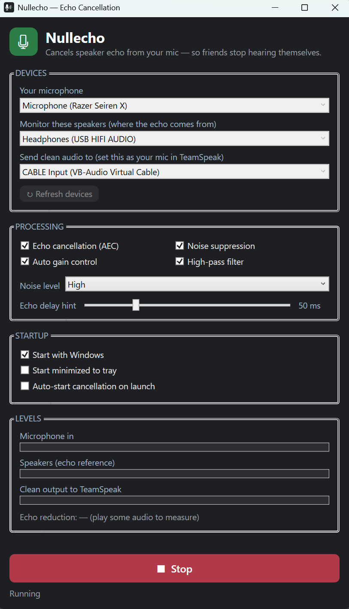

# Nullecho

**Real-time acoustic echo cancellation for Windows — so your friends stop hearing themselves.**

<p align="center"></p>

If you talk on TeamSpeak / Discord / Zoom through **speakers** instead of headphones, your
microphone picks up your friends' voices coming out of those speakers and sends them back —
so they hear themselves echoed. Nullecho captures what your speakers are playing, runs it
through the **WebRTC AEC3** echo canceller as a reference, and feeds a clean microphone signal
to a **virtual mic** that your chat app uses instead of your real one.

```
  microphone (your voice + echo) ─┐
                                  ├─► AEC3 + noise suppression + auto-gain ─► virtual mic ─► your chat app
  speakers loopback (reference) ──┘
```

> Measured ~25 dB of echo reduction; in practice your friends stop hearing themselves.

---

## Download & install

1. Download **Nullecho-Setup-1.0.0.exe** from the Releases page.
2. Run it. It's **self-contained** — you do **not** need to install .NET or anything else.
   - *(Unsigned app: Windows SmartScreen may say "Windows protected your PC." Click
     **More info → Run anyway**.)*
3. Install **VB-CABLE** (free virtual audio cable, required for the virtual mic):
   download from https://vb-audio.com/Cable/, run **VBCABLE_Setup_x64.exe as administrator**,
   install, and reboot.

**Requirements:** Windows 10/11 (64-bit) + VB-CABLE.

---

## Set it up (one-time)

**In Nullecho:**
- **Your microphone** → your real mic.
- **Monitor these speakers** → the device your chat app plays through (usually your default speakers — **not** CABLE).
- **Send clean audio to** → **CABLE Input (VB-Audio Virtual Cable)**.
- Click **Start**.

**In your chat app** (e.g. TeamSpeak → Tools → Options → Capture):
- **Capture device** → **CABLE Output (VB-Audio Virtual Cable)**.
- Turn **off** the app's own echo cancellation / echo reduction (two cancellers fight each other).

Done — your friends now hear the cleaned signal with the echo removed.

### Using it in a browser (Discord web, Google Meet, Zoom, Teams…)
Nullecho works with browser calls too: in the site's audio settings, choose **CABLE Output**
as your microphone (and allow mic access). If the browser's own echo/noise suppression ever
interferes, turn it off in the site's settings.

---

## Features

- WebRTC **AEC3** echo cancellation using your speaker output as the reference
- **Noise suppression**, **auto gain control**, **high-pass filter** (toggle each)
- Live level meters + an on-screen echo-reduction readout
- **System tray** — minimise or close to keep it running quietly in the background
- **Start with Windows**, **start minimised**, **auto-start on launch** — hands-off after a reboot
- Remembers your devices, options, and window position

---

## Tuning

- **Echo delay hint** — default 50 ms; AEC3 also auto-estimates. If faint echo remains, try 20–120 ms.
- **Noise suppression level** — High is a good default; VeryHigh is more aggressive.

## Troubleshooting

- **Friends still hear themselves** — make sure "Monitor these speakers" is the device your chat app
  actually plays through, and that the app's **own echo cancellation is OFF**. Nudge the delay slider.
- **No audio reaches the app** — confirm output = CABLE **Input** and the app's capture = CABLE **Output**.
- Errors are logged to `nullecho-crash.log` next to the app.

---

## License

Nullecho is **free software (freeware)** — see [EULA.txt](EULA.txt). It is **not** open source.
It includes third-party open-source components under their own licenses — see
[THIRD-PARTY-NOTICES.txt](THIRD-PARTY-NOTICES.txt). Made by TGL Ltd. Not affiliated with
VB-Audio, TeamSpeak, Discord, Xiph, or the WebRTC project.
